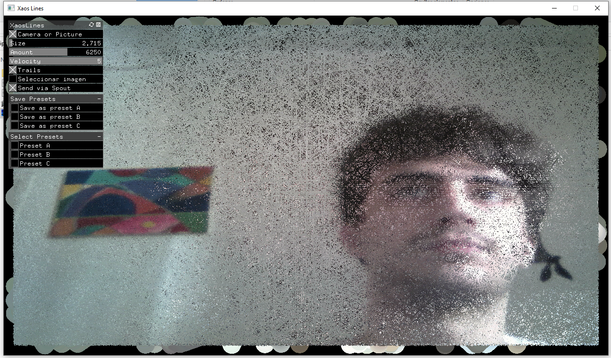

# XaosLines
Image disotortion plugin made with OpenFrameworks

    

XaosLines is a standalone program that takes the camera, or a still image, as an imput, and distorts it vía a points that move in
random directions. It has 3 parameters, the size of the points, the amount of points in the screen and the velocity.
With "Trails" you control if the points leave their past positions on the screen or if it just draws the current position of the point

You can change between the camera as the input or an image. You can also choose the image from your hard drive.
With "Save presets" you save can save up to 3 presets of the current state of the parameters. With "Select Presets"
you can change between the presets.

It also has a Spout sender to send to any program that has a spout receiver, such as Resolume Arena.
For that you will need to install "Spout Controls", wich is included in this repository. 

Sput Control website: https://spout.zeal.co/

This program was made for vjs, in live enviroments such as band shows, partys or gatherigs where you
need to distor the image that comes from a live feed. 

THINGS YOU CANT DO: -Minimize the window (it will crash the program)

Made by Alejo Cortiñaz
